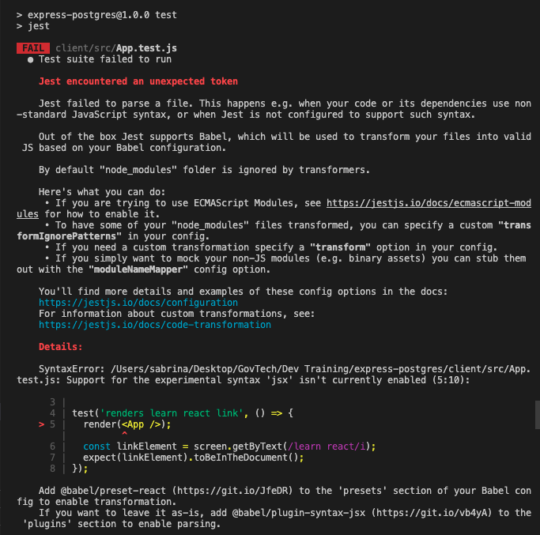

# TODO

- [ ] Lab: security-jwt ([mongoose version](https://thoughtworks-sea.github.io/developer-training/#/backend/security-jwt?id=lab-quick-start-security-jwt))
- [ ] Lab: hashing passwords with bcrypt ([mongoose version](https://thoughtworks-sea.github.io/developer-training/#/backend/mongodb/mongoose-middleware))
- [ ] Lab: express/postgres ([mongoose version](https://thoughtworks-sea.github.io/developer-training/#/backend/mongodb/express-mongoose-lab))
- [ ] [Guide to deploy express/postgres app on Heroku](https://thoughtworks-sea.github.io/developer-training/#/backend/express-deploy-postgres) (WIP)
- [ ] [Guide to deploy express/postgres/react app on Heroku](https://thoughtworks-sea.github.io/developer-training/#/delivering-software/deploying-full-stack) (WIP)
- [X] Hide pages on MongoDB from sidebar
- [..] Update Sequelize basics Notes
- [..] Create basic "Sequelize CRUD", combine "Sequelize Virtuals"?
- [..] Update Postgres Testing
- [ ] Create "Sequelize Validation"
- [ ] combine "Sequelize Virtuals" and Assocications ? Remove associations from Sequelize basics ?
- [ ] Finish off Postgres Basics Notes , extract from links in RDBMS_CONCEPTS

# express-postgres

Playground to set up Postgres in Express.

Packages used:

- [pg (node-postgres)](https://www.npmjs.com/package/pg)

Packages to potentially look into:

- [Sequelize](https://sequelize.org/) ORM
- [knex](https://github.com/knex/knex) query builder

See: https://blog.logrocket.com/why-you-should-avoid-orms-with-examples-in-node-js-e0baab73fa5/

## Installation

```
npm i express pg dotenv
npm i nodemon -D
```

## Configuration

.env

- for knex + sequelize
- same DB host and port

```sh
DB_DIALECT_SEQUELIZE=postgres

# For local only, when Postgres didn't support SSL.
# SSL is recommended for DB server in Production.
PG_SSL_MODE=false

# Use this variable to avoid connection issue with knex and sequelize.
# The same connection string will be used in both knex and sequelize,
# so be careful of the table naming.
# This variable will ignore the separate variables for DB connection.
DATABASE_URL=postgresql://<DB_USER>:<DB_PASS>@localhost:5432/<DATABASE_NAME>

# To use separate db for knex and sequelize, use the following parameters.
# You will need to make sure DATABASE_URL is NOT DEFINDED from .env
PG_HOST=localhost
PG_PORT=5432

PG_DATABASE=xxx
PG_USER=xxx
PG_PASSWORD=xxx

DB_NAME_SEQUELIZE=devTraining2021
DB_USER_SEQUELIZE=devtraining2021
DB_PASS_SEQUELIZE=
```

### [WIP] Test Your Setup

`npm run knex -- --help`

`npm run knex -- migrate:status`

`npm run knex:migrate`

`npm run sequelize -- --help`

`npm run sequelize:migrate` - upcoming

`npm start`

To access knex backed apis, goto: http://localhost:4000/api/users

To access sequelize backed apis, goto: http://localhost:4000/sequelize/users

---

## Configuration for KNEX

db.js

```
const { Pool } = require("pg");

const pool = new Pool({
  database: process.env.DB_NAME,
  host: process.env.DB_HOST,
  user: process.env.DB_USER,
  password: process.env.DB_PASS,
  port: process.env.DB_PORT,
});

module.exports = pool;
```

## Usage of KNEX

users.route.js (implementing this in routes for simplicity - best to extract the actual querying into a users.controller.js)

```
const express = require("express");
const router = express.Router();
const pool = require("../db");

router.get("/", async (req, res) => {
  try {
    let users = await pool.query("SELECT * FROM users");
    res.status(200).json(users.rows);
  } catch (err) {
    res.status(500);
  }
})

router.get("/:id", async (req, res) => {
  try {
    const { id } = req.params;
    const user = await pool.query(
      "SELECT * FROM users WHERE id = $1",
      [id]
    );
    res.status(200).json(user.rows[0]);
  } catch (err) {
    res.status(500);
  }
})

module.exports = router;
```

`npm start`

### [WIP] Authentication

(can abandon if we go with Sequelize)
(probably similar for Sequelize, just changes in model I guess - TBC)

From: https://gist.github.com/laurenfazah/f9343ae8577999d301334fc68179b485

```
npm i bcrypt knex
npm i -g knex
```

```
// knexfile.js
exports.up = function (knex, Promise) {
  let createQuery = `CREATE TABLE users(
    id SERIAL PRIMARY KEY NOT NULL,
    username TEXT,
    token TEXT,
    password_digest TEXT,
    created_at TIMESTAMP
  )`;
  return knex.raw(createQuery);
};

exports.down = function (knex, Promise) {
  let dropQuery = `DROP TABLE users`;
  return knex.raw(dropQuery);
};
```

Create migration file

`knex migrate:make create-users-table`

Migrate

```
knex migrate:latest
```

TODO: set up User model

---

# Testing

## Installation

Packages used:

- [pg-mem](https://www.npmjs.com/package/pg-mem)
- jest
- supertest

```
npm i pg-mem jest supertest -D
```

## Usage

Implementation can be further refined? Can also explore other alternatives to `pg-mem`.

users.route.test.js

```
const { newDb } = require("pg-mem");
const { Pool: MockPool } = newDb().adapters.createPg();
const mockPool = new MockPool();

jest.mock("../db", () => {
  return {
    query: jest.fn().mockImplementation((...args) => {
      return mockPool.query(...args);
    })
  };
});

describe("users", () => {
  beforeAll(async () => {
    await mockPool.query(
      "CREATE TABLE IF NOT EXISTS users (id SERIAL PRIMARY KEY, name TEXT(255))"
    );
    await mockPool.query(
      "INSERT INTO users (name) VALUES ('Sabrina')"
    );
  });

  afterAll(async () => {
    await mockPool.query("DROP TABLE IF EXISTS users");
  });
});
```

`npm run test`

---

# Path to Production

Instructions for deploying is updated in the guides here: https://thoughtworks-sea.github.io/developer-training/#/delivering-software/deploying-full-stack

App URL: https://express-postgres.herokuapp.com/

# Troubleshooting

## Running locally

If running the app locally, be sure to add these env vars in `client/.env`:

- REACT_APP_API_URL=http://localhost:4000
- SKIP_PREFLIGHT_CHECK=true (may not be needed if you don't have any errors prompting for this)

## React tests not running

If your run into this error running React tests on your project:



Install these packages:

```
npm i -D @babel/plugin-syntax-jsx @babel/plugin-transform-runtime @babel/preset-env @babel/preset-react jest-transform-css
```

You will also need to configure babel and jest. Refer to this commit: https://github.com/sabrina-tw/express-postgres/commit/d1b571bbcf7a78ed511d19cee4d07b4a21468b25

References:

- https://github.com/testing-library/react-testing-library/issues/422

# SSL connection to the Postgres DB

It is recommended to require SSL connection on NodeJS clients.
See: https://devcenter.heroku.com/articles/heroku-postgresql#heroku-postgres-ssl

The code has been configured to support SSL connection from clients, however this requires the Postgres DB to be configured with self-signed cert. Thus a conditional based on environment variable `PG_SSL_MODE` was added to toggle the SSL connection in `db/index.js` (knex) and `sequelize.js` (sequelize).

    ```sh
      # .env
      PG_SSL_MODE=false
    ```

*To set up postgres with Self-Signed Cert in Dev env*

References:
- https://kb.objectrocket.com/postgresql/configure-a-postgresql-server-1273
- https://www.postgresql.org/docs/13/runtime-config-connection.html#RUNTIME-CONFIG-CONNECTION-SSL

Steps:
1. Locate the `postgresql.conf` on the dev machine. For MacOS, usually it's in `/usr/local/var/postgres`.

2. Navigate to the postgres config folder and backup the file `postgresql.conf`.
    ```sh
      cd /usr/local/var/postgres
      cp postgresql.conf postgresql.conf.backup
    ```

3. Create self-signed cert. Suggest to create a folder `ssl` to store the configuration.
    - We are creating a non-expiring cert and with the default configuration of openssl.
    - Note that you might required to use a PEM passphrase for the private key. *Please remember this passphrase as you will need it to update `postgresql.conf` later*.

    ```sh
    mkdir ssl && cd ssl

    # Create Private Key and Certificate Signing Request (CSR)
    openssl req -newkey rsa:2048 -keyout server.key -out server.csr

    # Sign the CSR to generate a self-signed certificate
    openssl req -x509 -in server.csr -text -key server.key -out server.crt
    ```

4. Update `postgresql.conf` to enable ssl configuration.
    ```
      # - SSL -

      ssl = on
      #ssl_ca_file = ''
      ssl_cert_file = 'ssl/server.crt'
      #ssl_crl_file = ''
      ssl_key_file = 'ssl/server.key'
      #ssl_ciphers = 'HIGH:MEDIUM:+3DES:!aNULL' # allowed SSL ciphers
      #ssl_prefer_server_ciphers = on
      #ssl_ecdh_curve = 'prime256v1'
      #ssl_min_protocol_version = 'TLSv1.2'
      #ssl_max_protocol_version = ''
      #ssl_dh_params_file = ''
      ssl_passphrase_command = 'echo "<YOUR_PASSPHRASE>"'
      ssl_passphrase_command_supports_reload = on
    ```

5. Run the following to restart Postgres services. The commands are for installation via Homebrew on Mac, please refer to first reference if you are not on this setup.

    ```sh
      # get the status of brew services, note on postgresql service.
      brew services

      # restart the postgresql service
      brew services restart postgresql

      # check the status again to confirm the configuration is fine
      brew services
    ```

6. Test your app.

    Remove this settings from .env
    ```
      PG_SSL_MODE=false
    ```